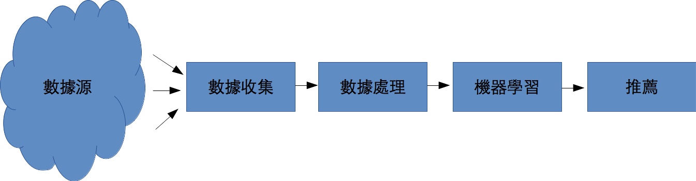

# 機器學習系統的技術債

D. Sculley等人在NIPS 2014發表了一篇很棒的非技術文章[@Sculley2014NIPS]，探討許多機器學習系統在實務上遇到的維護問題和解決方法。
恰好這三年來我也實作了一套推薦系統，文章中探討的雷也踩了不少，導致這陣子都在還債，讀來更有許多共鳴。
這篇文章，就以我親身經歷為例，探討[@Sculley2014NIPS]中的提出的觀點。

## 什麼是技術債？

在實務上，工程師常常因為時間壓力而必須在短時間內完成任務。
此時，工程師們會寫出未經完整思考和良好的設計的系統，導致未來維護系統時，必須要花更多的時間來重新整理這些趕出來的工作。

技術債是Ward Cunningham 在1992年提出的一種概念，泛指不良的系統設計、系統架構和程式碼品質對後續系統維護的難度和工作量所造成的衝擊。
這是一個很生動的比喻方法。

技術債和財務上的債務，有許多可以類比的地方。舉例來說，我們產生財務上的債務時，是要解決立即性的金錢需求，才透過借貸而產生債務。
這些債務並不是免費的，它們會一直產生利息。
而經過一段時間之後，我們總是要擠出金錢來把債務還清，否則就會導致債務越來越大，最終造成破產。

技術債之中，工程師為了要在短時間內完成產品，只好先略過糟糕的設計和程式碼，把任務完成再說。而後續在維護時，就必須面對當初留下的爛攤子。
舉例來說，有些工程師會透過大量的複製與貼上程式碼，或是把參數寫死來快速完成任務。
然而後續在修改功能時，就會發生漏改參數，或是漏改其中一份程式碼副本的狀況。
因此，工程師就需要花更多的時間來維護系統，而如果這些時間沒有解決問題，那僅止是在償還利息而已。
近代軟體工程講究利用重構(refactoring)、增加測試的覆蓋率、刪除不使用的程式碼、降低系統間的相依性、改良API的設計、改善文件等方法來克服技術債帶來的問題(請參考M. Fowler在1999的著作[@Fowler1999])。
這些動作不會為了系統帶來的新的功能，而是為了降低未來開發和維護的難度，償還過去所欠下的技術債。

## 機器學習系統

近年來由於數據科學的興起，企業們都希望建立數據產品來解決它們的問題。
機器學習系統是一種常見數據產品，例如現在各個網站均具備的推薦系統，就是一種機器學習系統。
那實際上的機器學習系統看起來像是怎樣呢？

以一個廣告推薦引擎系統為例，首先企業需要建立許多數據收集模組。
通常收集到的數據也很難直接利用，因此還要建立數據處理模組。
再來才能依據這些數據建立機器學習模組。
最後還要建立推薦模組，讓線上服務可以運用數據分析的成果。
從數據收集、數據處理、機器學習到推薦，這樣的架構在許多機器學習系統中都非常常見。

## 機器學習系統與技術債

機器學習系統是由代碼建立而成的，所以**所有軟體工程上會遇到的問題，機器學習系統都會遇到**。
除此之外，機器學習系統還會對整體系統導入一種**系統層面的複雜度**，而這些系統層面的複雜度也會對未來的維護造成困難，所以在[@Sculley2014NIPS]之中也認為這是另一種技術債的來源。
為了清楚起見，以下我們就稱呼這類債務為**系統債**。

因此，機器學習系統也需要工程師利用重構或撰寫單元測試，來降低它的技術債。
但是這樣的動作沒辦法降低**系統層面的複雜度**，所以也沒辦法償還系統債。
以推薦引擎系統為例，機器學習系統的效果就會和數據收集、數據分析和推薦系統息息相關。
而這樣複雜的系統架構之下，技術債和系統債很容易產生並且累積。
如果我們僅僅是對各個模組撰寫單元測試，這樣的測試並沒辦法反應和控制數據收集模組對推薦模組的影響。

為了要增加推薦的精準度，資料收集模組也往往想要擴增更大量的資料源，這就導致大量的整合系統的程式碼(glue code)的產生。
而這也導致如果外在系統產生變化，這些變化產生資料的變化，跟著資料擴散至整個機器學習系統之中，對最後推薦的結果產生影響。

# 系統複雜度破壞了我們對相依性的控制

傳統軟體工程講究使用*封裝*和*模組化*來產生易維護的程式碼。因此在設計的時候，工程師應該會在概念上先建立一層又一層的模組，嚴格控制模組之間的相依性。
舉例來說，在推薦系統的時候，工程師會把收集的動作放置到數據收集模組，而把一些資料轉換（例如：把時間的精確度從毫秒降低到小時、把收集到的數值做分群）的動作放置到數據處理模組。
工程師也會定義模組的輸入與輸出的規格。而數據處理模組也只能使用數據收集模組的產出，而不能使用數據內部模組使用的函數。

透過系統設計的規劃，我們可以掌控修改程式碼地影響範圍，讓工程師在未來更容易去修改程式碼和改進程式碼。

但是，機器學習系統要解決的問題，是**無法單純透過軟體的邏輯來定義解決辦法，而是必須要結合軟體邏輯與外部資料才能定義解決辦法**。
這樣的特性導致機器學習系統會侵蝕模組之間的界面，最終導致我們失去對相依性的控制。

## 糾結

機器學習系統的特性，就是會把大量的資料源混在一起。這導致我們不可能有效的控制程式碼對整體系統的影響，因而在改善系統的工作上變得更加困難。

舉例來說，推薦系統根據以下面向來做學習：年齡、性別、血型、地區...等等。
機器學習模組會從資料中學到，每一個面向對推薦的決定所造成的影響力，這些影響力會很精確的以數值表示。
當我們要加入一個新的面向，如：IP的時候，由於IP和其它的面向有部分的相似性，這個面向會影響到所有其它面向的影響力。
舉例來說，我們知道IP其實和地區有關，例如140.112.*.*的IP代表著來自臺大。
原本臺大校園地區的影響力，就會和IP的影響力重複。
因此地區的影響力的數值，就會因為我們在系統中增加了IP的面向，而產生改變。
[@Sculley2014NIPS]之中稱呼這樣的特性為：*CACE原理*(Changing Anything Changes Everything.)

這樣的特色就會導致，只要我們對任何模組做更動，最終推薦的結果都會產生輕微或是劇烈的改變。

[@Sculley2014NIPS]提出了以下數個解決辦法。

### 單獨學若干個模型，再把它們結合成最終模型

我們可以先分解問題，並且對每個問題單獨學習一個機器學習模型，再想辦法把這些模型結合起來，用於最終的推薦模組之中。
舉例來說，我們可以針對3C類的商品建立一個模型、針對女性保養品建立一個模型，並且再這兩個模型之上再建立一個推薦模型。

由於每個模型不一定會學習所有面向，所以我們就比較能控制**糾結**對整體系統的影響。舉例來說，女性商品的模型可能不學血型這個面向，所以當我們修改的程式是牽涉到血型的時候，女性商品的模型就不會收到**糾結**的影響。

但是在許多大規模的學習系統中，這種分解可能會導致效能上的問題，並且**糾結**也會在各個子模型之中出現。

[@Sculley2014NIPS]之中是以[@Sculley2011KDD]為範例，有興趣的讀者可以去了解細節，以上的說明只是我個人的理解。

### 模型的解釋性

如果我們對模型的學習動作，有本質性的了解時，那我們也能控制資料對最終推薦結果的衝擊。
有一些文獻和工具能幫助研究人員視覺化**糾結**的影響，因而讓我們控制**糾結**對系統的影響。在[@Mcmahan2013KDD]中介紹的GridViz就是一個幫助研究人員檢視各種面向對各種資料類型的影響。

### 

# 參考文獻

